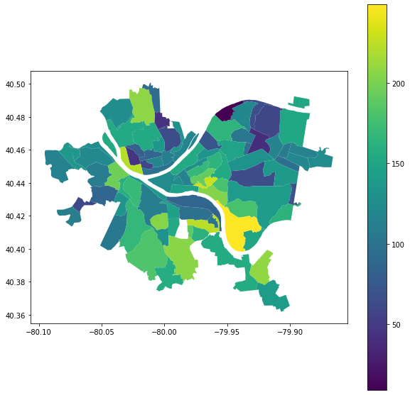

# CMPINF 0010 Final Project
CMPINF 0010 FINAL PROJECT REPOSITORY - By Bussin' (Canvas Group #24)

This project provides an insight to which neighborhood in Pittsbrugh is the best rated on a 3-dimensional environmental-and-health metric. Submetrics include pollution (PM 2.5), illegal dump sites, and hypertension and hyperlipidemia situations in each of the neighborhoods.

Upper Lawrenceville is the best neighborhood!

  

**Datasets**: 
[Allegheny County Particulate Matter 2.5](https://data.wprdc.org/dataset/particulate-matter-2-5) analyzed by Peter Ju 
[Allegheny County Illegal Dump Sites](https://data.wprdc.org/dataset/allegheny-county-illegal-dump-sites) analyzed by Peter Ju 
[Hypertension + Hyperlipidemia comorbidity](https://data.wprdc.org/dataset/hypertension-hyperlipidemia-comorbidity) analyzed by Leo Liang 

**Group Members**:
  - Peter Ju [zij15@pitt.edu](zij15@pitt.edu)  
  - Leo Liang [lel144@pitt.edu](lel144@pitt.edu)  
